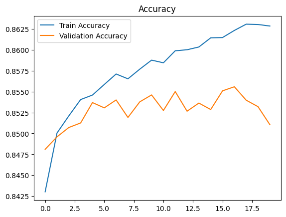
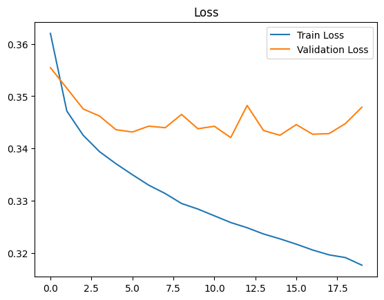

# 🌧️ Rain Prediction using Artificial Neural Network (ANN)

---

## 📌 Project Overview
This project uses an Artificial Neural Network (ANN) to predict whether it will rain the next day based on historical weather data.

It is a binary classification problem:
- 1 → Rain
- 0 → No Rain

The model learns patterns from weather features and predicts future rainfall.

---

## 📊 Dataset Description

The dataset used is the **Weather Australia dataset** (Kaggle).

### 📥 Input Features:
- Temperature (Min & Max)
- Humidity
- Wind Speed
- Atmospheric Pressure
- Rainfall today

### 🎯 Target Variable:
- **RainTomorrow**
  - Yes (Rain)
  - No (No Rain)

👉 The model predicts tomorrow’s rain based on today’s weather conditions.

---

## ⚙️ Methodology

1. Load dataset  
2. Handle missing values  
3. Encode categorical variables  
4. Feature scaling using StandardScaler  
5. Split dataset into training and testing sets  
6. Build Artificial Neural Network (ANN)  
7. Train model  
8. Evaluate performance  

---

## 🧠 Model Architecture

- Input Layer  
- Dense Layer (64 neurons, ReLU)  
- Dropout (0.3)  
- Dense Layer (32 neurons, ReLU)  
- Dropout (0.2)  
- Output Layer (Sigmoid activation)  

---

## 🚀 Training Details

- Optimizer: Adam  
- Loss Function: Binary Cross-Entropy  
- Epochs: 20  
- Batch Size: 32  

---

## 📈 Results
---
The model shows strong performance:
-Accuracy:0.8481025711535818
precision:0.688737973967176
Recall:0.5686915887850468
F1 score:0.6229843869976964
---

## 📊 Graphs

### 🔹 Accuracy Graph

### 🔹 Loss Graph

### 🔹 Confusion Matrix

---

## 🎯 Conclusion

This project demonstrates that Artificial Neural Networks can effectively learn complex weather patterns and predict rainfall with good accuracy. It highlights the importance of machine learning in real-world forecasting problems.

---

## 👨‍💻 Author
Faiz Ahmed,BS-Mathematics,Sukkur IBA University
